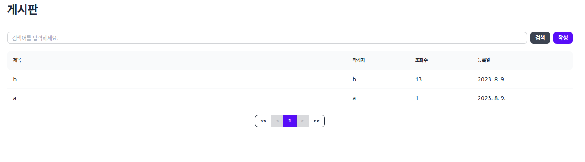
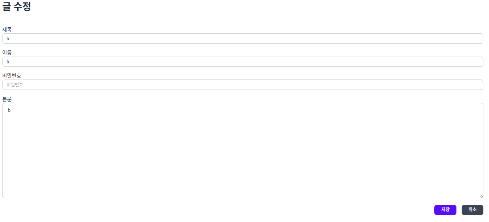
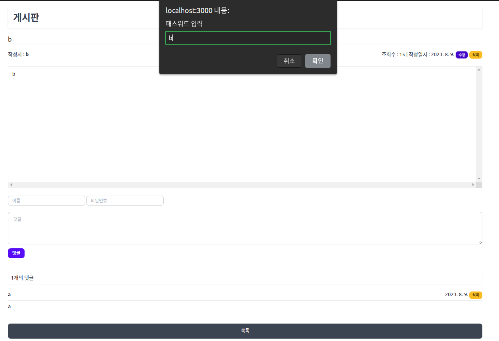
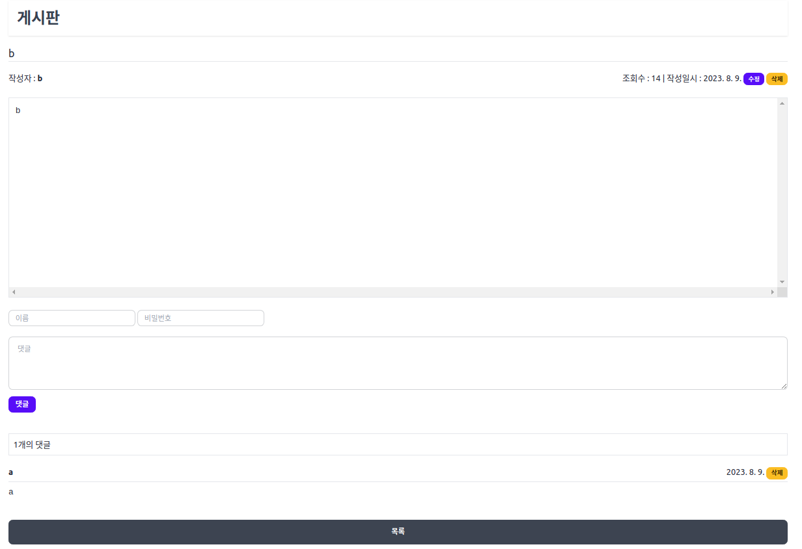

# Board
#### ⚪ About Project
* ##### 패스워드 인증기반 글(작성, 수정, 삭제, 조회), 댓글(작성, 삭제)을 가진 게시판 서비스 앱
* ##### NodeJs, Express, MongoDB, 템플릿엔진인 express-handlebars를 사용해 게시판 서비스 앱 구축

- - -

#### ⚪ Running Screen || Video
<p align="center">
  <a href="https://www.youtube.com/watch?v=b2JAx2kzs_g"></a>
  </br>
  
  
</p>
<p align="center">
  
  
</p>

- - -

#### ⚪ Built With

| **Category** |**Skills**| 
|-------------|---------|
|**Language**|    |
|**Frontend**|  |
|**Backend**|   |
| **Database**| |
| **Env**|  


- - -

#### ⚪ Getting Started
```bash
# prerequisites: npm, node, mongodb(docker)
# execution
docker-compose up -d
git clone https://github.com/MpqM/WebApp_Board.git
npm install
npm start
```

- - -

#### ⚪ Description
* ##### 게시글
   * ##### 게시글 작성시 비밀번호 해쉬 처리후 DB저장
   * ##### 게시글 상세보기를 통해 게시물 정보(댓글, 작성자, 작성일자 등)확인
   * ##### 게시글 수정, 삭제시 check-pasword API 을 통해 비인가적인 삭제 호출 막음
* ##### 댓글
   * ##### DB의 Post에 배열 형식으로 Post DB에 존재 
   * ##### 댓글 작성시 비밀번호 해쉬 처리후 Post DB destruct 후 저장
   * ##### 댓글 삭제시 2중 쿼리사용 API를 통해 비밀번호 인증후 삭제
* ##### 메인 리스트
    * ##### 리스트에서 게시글 목록, 검색, 페이지 네이션
    * ##### 페이지네이션구현 -> utils/paginator.js 참조

- - -

#### ⚪ Writer
<p align ="center">
  </a> <a href = "https://github.com/MpqM"></a> <a href = "https://MpqM.tistory.com/"> </a>
</p>

- - -